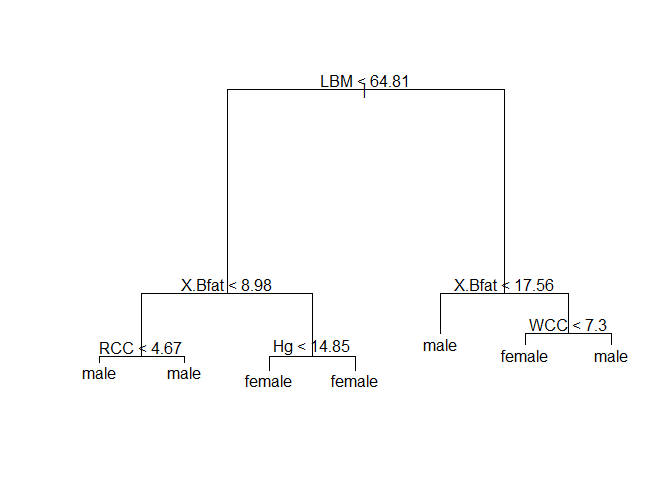

Classification for sport and sex
================

- ***Classification, Fit an LDA model for the feature/variable
  “sports”***

``` r
m1<-lda(D$Sport~., data=D)
m2<-predict(m1)
t1<-table(D$Sport,m2$class)
t1
```

    ##          
    ##           BBall Field Gym Netball Row Swim T400m Tennis TSprnt WPolo
    ##   BBall      12     0   0       3   7    3     0      0      0     0
    ##   Field       0    12   0       0   1    1     0      1      1     3
    ##   Gym         0     0   4       0   0    0     0      0      0     0
    ##   Netball     3     0   0      17   1    0     0      1      0     1
    ##   Row         2     2   1       2  23    4     1      0      0     2
    ##   Swim        1     0   0       1   3   13     3      1      0     0
    ##   T400m       0     0   0       0   2    2    22      1      2     0
    ##   Tennis      0     0   1       1   1    0     0      6      2     0
    ##   TSprnt      0     0   0       0   2    2     1      0     10     0
    ##   WPolo       2     2   0       0   0    1     2      0      0    10

``` r
sum(diag(t1))/sum(t1)
```

    ## [1] 0.6386139

**After fitting the LDA model for the variable sports we have the
following table of the fitted values.**

**The percentage of the correct fitted values is 63.8%.**

\-***Fit an k-nn model for the gender.***

``` r
k1<-knn(D[,3:13],D[,3:13], cl=D$Sex,k=3)
t4=table(D$Sex,k1)
t4
```

    ##         k1
    ##          female male
    ##   female     97    3
    ##   male        2  100

``` r
sum(diag(t4))/sum(t4)
```

    ## [1] 0.9752475

**After fitting a k-nn model for the variable sex we have the following
table of the fitted values.**

**The percentage of the correct fitted values is 97.5%**

**Decision tree for the gender**

``` r
fit<-tree(as.factor(Sex)~.,data=D)
plot(fit)
text(fit)
```

<!-- -->

``` r
predict(fit,type='tree')
```

    ## node), split, n, deviance, yval, (yprob)
    ##       * denotes terminal node
    ## 
    ##  1) root 202 280.000 male ( 0.49505 0.50495 )  
    ##    2) LBM < 64.81 107  79.160 female ( 0.87850 0.12150 )  
    ##      4) X.Bfat < 8.98 13  11.160 male ( 0.15385 0.84615 )  
    ##        8) RCC < 4.67 5   6.730 male ( 0.40000 0.60000 ) *
    ##        9) RCC > 4.67 8   0.000 male ( 0.00000 1.00000 ) *
    ##      5) X.Bfat > 8.98 94  19.360 female ( 0.97872 0.02128 )  
    ##       10) Hg < 14.85 87   0.000 female ( 1.00000 0.00000 ) *
    ##       11) Hg > 14.85 7   8.376 female ( 0.71429 0.28571 ) *
    ##    3) LBM > 64.81 95  44.760 male ( 0.06316 0.93684 )  
    ##      6) X.Bfat < 17.56 85   0.000 male ( 0.00000 1.00000 ) *
    ##      7) X.Bfat > 17.56 10  13.460 female ( 0.60000 0.40000 )  
    ##       14) WCC < 7.3 5   0.000 female ( 1.00000 0.00000 ) *
    ##       15) WCC > 7.3 5   5.004 male ( 0.20000 0.80000 ) *

``` r
t7=table(D$Sex,predict(fit,D,type="class"))
sum(diag(t7))/sum(t7)
```

    ## [1] 0.9752475

**After fitting a decision tree model, we have the following
tree-plot**  
**The accuracy of the decision tree is 97.5%**

**The predicted gender for a Gym athlete with the mean value for all the
covariates**

``` r
mean(D$LBM)
```

    ## [1] 64.87371

``` r
mean(D$X.Bfat)
```

    ## [1] 13.50743

> Since the mean of LBM is 64.87 and the mean of X.Bfat is 13.51.

> The gender is male, according to the decision tree.
