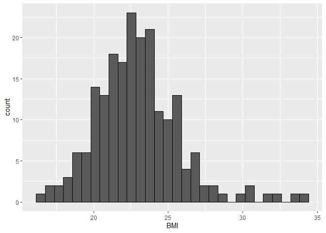

Exploratory Analysis
================

### Explore Data

**First rows of the data**

``` r
head(D)
```

    ##      Sex Sport  RCC WCC   Hc   Hg Ferr   BMI   SSF X.Bfat   LBM    Ht   Wt
    ## 1 female BBall 3.96 7.5 37.5 12.3   60 20.56 109.1  19.75 63.32 195.9 78.9
    ## 2 female BBall 4.41 8.3 38.2 12.7   68 20.67 102.8  21.30 58.55 189.7 74.4
    ## 3 female BBall 4.14 5.0 36.4 11.6   21 21.86 104.6  19.88 55.36 177.8 69.1
    ## 4 female BBall 4.11 5.3 37.3 12.6   69 21.88 126.4  23.66 57.18 185.0 74.9
    ## 5 female BBall 4.45 6.8 41.5 14.0   29 18.96  80.3  17.64 53.20 184.6 64.6
    ## 6 female BBall 4.10 4.4 37.4 12.5   42 21.04  75.2  15.58 53.77 174.0 63.7

**Variables types**

``` r
str(D)
```

    ## 'data.frame':    202 obs. of  13 variables:
    ##  $ Sex   : chr  "female" "female" "female" "female" ...
    ##  $ Sport : chr  "BBall" "BBall" "BBall" "BBall" ...
    ##  $ RCC   : num  3.96 4.41 4.14 4.11 4.45 4.1 4.31 4.42 4.3 4.51 ...
    ##  $ WCC   : num  7.5 8.3 5 5.3 6.8 4.4 5.3 5.7 8.9 4.4 ...
    ##  $ Hc    : num  37.5 38.2 36.4 37.3 41.5 37.4 39.6 39.9 41.1 41.6 ...
    ##  $ Hg    : num  12.3 12.7 11.6 12.6 14 12.5 12.8 13.2 13.5 12.7 ...
    ##  $ Ferr  : int  60 68 21 69 29 42 73 44 41 44 ...
    ##  $ BMI   : num  20.6 20.7 21.9 21.9 19 ...
    ##  $ SSF   : num  109.1 102.8 104.6 126.4 80.3 ...
    ##  $ X.Bfat: num  19.8 21.3 19.9 23.7 17.6 ...
    ##  $ LBM   : num  63.3 58.5 55.4 57.2 53.2 ...
    ##  $ Ht    : num  196 190 178 185 185 ...
    ##  $ Wt    : num  78.9 74.4 69.1 74.9 64.6 63.7 75.2 62.3 66.5 62.9 ...

**Summary of each Variable**

``` r
summary(D)
```

    ##      Sex               Sport                RCC             WCC        
    ##  Length:202         Length:202         Min.   :3.800   Min.   : 3.300  
    ##  Class :character   Class :character   1st Qu.:4.372   1st Qu.: 5.900  
    ##  Mode  :character   Mode  :character   Median :4.755   Median : 6.850  
    ##                                        Mean   :4.719   Mean   : 7.109  
    ##                                        3rd Qu.:5.030   3rd Qu.: 8.275  
    ##                                        Max.   :6.720   Max.   :14.300  
    ##        Hc              Hg             Ferr             BMI       
    ##  Min.   :35.90   Min.   :11.60   Min.   :  8.00   Min.   :16.75  
    ##  1st Qu.:40.60   1st Qu.:13.50   1st Qu.: 41.25   1st Qu.:21.08  
    ##  Median :43.50   Median :14.70   Median : 65.50   Median :22.72  
    ##  Mean   :43.09   Mean   :14.57   Mean   : 76.88   Mean   :22.96  
    ##  3rd Qu.:45.58   3rd Qu.:15.57   3rd Qu.: 97.00   3rd Qu.:24.46  
    ##  Max.   :59.70   Max.   :19.20   Max.   :234.00   Max.   :34.42  
    ##       SSF             X.Bfat            LBM               Ht       
    ##  Min.   : 28.00   Min.   : 5.630   Min.   : 34.36   Min.   :148.9  
    ##  1st Qu.: 43.85   1st Qu.: 8.545   1st Qu.: 54.67   1st Qu.:174.0  
    ##  Median : 58.60   Median :11.650   Median : 63.03   Median :179.7  
    ##  Mean   : 69.02   Mean   :13.507   Mean   : 64.87   Mean   :180.1  
    ##  3rd Qu.: 90.35   3rd Qu.:18.080   3rd Qu.: 74.75   3rd Qu.:186.2  
    ##  Max.   :200.80   Max.   :35.520   Max.   :106.00   Max.   :209.4  
    ##        Wt        
    ##  Min.   : 37.80  
    ##  1st Qu.: 66.53  
    ##  Median : 74.40  
    ##  Mean   : 75.01  
    ##  3rd Qu.: 84.12  
    ##  Max.   :123.20

**Number of sport’s followers and each sex in the data**

``` r
D %>% count(Sport)
```

    ##      Sport  n
    ## 1    BBall 25
    ## 2    Field 19
    ## 3      Gym  4
    ## 4  Netball 23
    ## 5      Row 37
    ## 6     Swim 22
    ## 7    T400m 29
    ## 8   TSprnt 15
    ## 9   Tennis 11
    ## 10   WPolo 17

``` r
D %>% count(Sex)
```

    ##      Sex   n
    ## 1 female 100
    ## 2   male 102

**BMI distribution**

``` r
D %>% ggplot(aes(x = BMI)) + geom_histogram(color='black',bins=30)
```

<!-- -->

**BMI for each sex**

``` r
D %>% ggplot(aes(x = Sex, y=BMI, color=factor(Sex))) + geom_boxplot() + geom_point()
```

<!-- -->

**BMI for each Sport**

``` r
D %>% ggplot(aes(x = Sport, y=BMI, color=factor(Sport))) + geom_boxplot() + geom_point()
```

<!-- -->

**Scatter plot Height and Weight**

``` r
plot(D$Wt,D$Ht,cex.lab=1.5, main="Scatterplot", cex.main=3, cex=1.5)
```

<!-- -->

**Linear Regression plot for Weight and Height**

``` r
D %>% ggplot(aes(x = Ht, y=Wt)) + geom_point() + geom_smooth(method='lm')
```

    ## `geom_smooth()` using formula = 'y ~ x'

<!-- -->

**Plot for each sex**

``` r
D %>% ggplot(aes(x = Ht, y=Wt, color=factor(Sex))) + geom_point() + geom_smooth(method='lm',se=FALSE)
```

    ## `geom_smooth()` using formula = 'y ~ x'

<!-- -->

**Variables’ correlation**

``` r
GGally::ggpairs(D[3:13])
```

<!-- -->

``` r
ggpairs(D[3:13],mapping=aes(color=factor(D$Sex)))
```

<!-- -->
