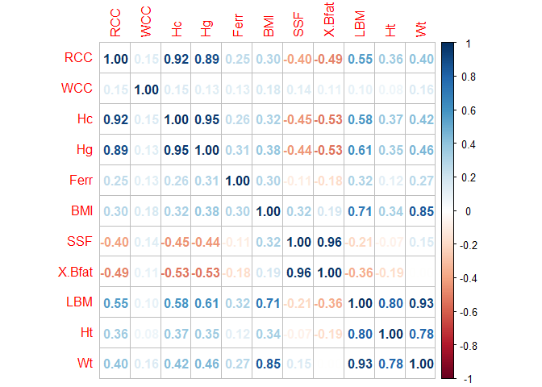
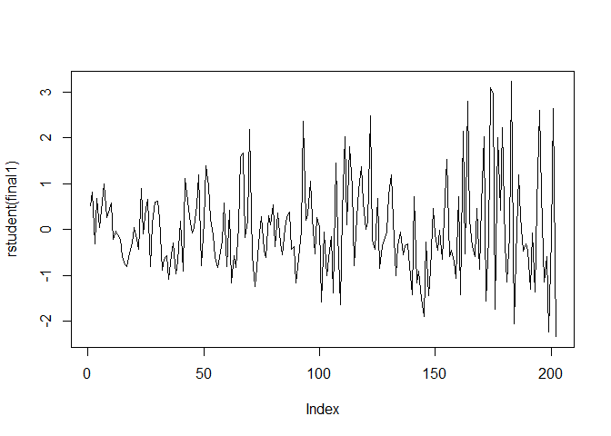

Ferretin Linear Regression
================

***Multiple Linear Regression for Ferretin.***

- **Using as response variable the plasma ferritins(Ferr), we’ll get the
  variable selection by using the stepwise methods for both
  directions(adding and removing variables).**

- **Descriptive Statistics for each variable**

``` r
D$Ferr<-as.numeric(D$Ferr)
numeric.only <- sapply(D,class)=='numeric'
num <- D[ , numeric.only]
n<-nrow(num)
round(t(describe(num)),1)
```

    ##            RCC   WCC    Hc    Hg  Ferr   BMI   SSF X.Bfat   LBM    Ht    Wt
    ## vars       1.0   2.0   3.0   4.0   5.0   6.0   7.0    8.0   9.0  10.0  11.0
    ## n        202.0 202.0 202.0 202.0 202.0 202.0 202.0  202.0 202.0 202.0 202.0
    ## mean       4.7   7.1  43.1  14.6  76.9  23.0  69.0   13.5  64.9 180.1  75.0
    ## sd         0.5   1.8   3.7   1.4  47.5   2.9  32.6    6.2  13.1   9.7  13.9
    ## median     4.8   6.8  43.5  14.7  65.5  22.7  58.6   11.7  63.0 179.7  74.4
    ## trimmed    4.7   7.0  43.1  14.6  70.1  22.8  65.2   12.9  64.5 180.3  74.8
    ## mad        0.5   1.6   3.7   1.5  37.8   2.5  26.0    6.5  13.8   9.0  13.6
    ## min        3.8   3.3  35.9  11.6   8.0  16.8  28.0    5.6  34.4 148.9  37.8
    ## max        6.7  14.3  59.7  19.2 234.0  34.4 200.8   35.5 106.0 209.4 123.2
    ## range      2.9  11.0  23.8   7.6 226.0  17.7 172.8   29.9  71.6  60.5  85.4
    ## skew       0.4   0.8   0.3   0.2   1.3   0.9   1.2    0.8   0.4  -0.2   0.2
    ## kurtosis   0.6   1.4   0.9   0.0   1.4   2.1   1.3   -0.2  -0.3   0.5   0.4
    ## se         0.0   0.1   0.3   0.1   3.3   0.2   2.3    0.4   0.9   0.7   1.0

- **Correlations between variables**

``` r
corrplot(cor(num),method='n')
```

<!-- -->

- **Linear Regression Model Fitting**

``` r
analysis<-lm(Ferr~., data=D)
summary(analysis)
```

    ## 
    ## Call:
    ## lm(formula = Ferr ~ ., data = D)
    ## 
    ## Residuals:
    ##     Min      1Q  Median      3Q     Max 
    ## -84.517 -25.418  -4.959  19.856 112.119 
    ## 
    ## Coefficients:
    ##              Estimate Std. Error t value Pr(>|t|)    
    ## (Intercept)  504.6813   461.4730   1.094  0.27557    
    ## Sexmale       69.9557    15.3824   4.548  9.9e-06 ***
    ## SportField    35.1414    16.8611   2.084  0.03855 *  
    ## SportGym       0.7762    30.6206   0.025  0.97981    
    ## SportNetball  19.8248    13.7525   1.442  0.15116    
    ## SportRow      20.1107    11.4562   1.755  0.08088 .  
    ## SportSwim     28.2024    13.7362   2.053  0.04150 *  
    ## SportT400m    -1.9618    14.8544  -0.132  0.89508    
    ## SportTennis   52.8469    16.7429   3.156  0.00187 ** 
    ## SportTSprnt   33.6984    17.5028   1.925  0.05576 .  
    ## SportWPolo    35.8072    14.4543   2.477  0.01416 *  
    ## RCC          -27.5724    18.8409  -1.463  0.14508    
    ## WCC            1.4167     1.8199   0.778  0.43731    
    ## Hc            -1.8963     3.3295  -0.570  0.56969    
    ## Hg             8.4485     7.6272   1.108  0.26947    
    ## BMI           -5.6716    10.4735  -0.542  0.58882    
    ## SSF           -0.1967     0.4867  -0.404  0.68660    
    ## X.Bfat         1.2729     4.4289   0.287  0.77412    
    ## LBM           -1.7123     5.2177  -0.328  0.74316    
    ## Ht            -2.2947     2.5653  -0.894  0.37225    
    ## Wt             3.2803     5.3491   0.613  0.54049    
    ## ---
    ## Signif. codes:  0 '***' 0.001 '**' 0.01 '*' 0.05 '.' 0.1 ' ' 1
    ## 
    ## Residual standard error: 40.67 on 181 degrees of freedom
    ## Multiple R-squared:  0.3399, Adjusted R-squared:  0.2669 
    ## F-statistic: 4.659 on 20 and 181 DF,  p-value: 6.403e-09

> Summary of the full model. Most of the variables does not seem
> significant due to high p_values.  
> Also the R-squared= 0.3399 is not very high.

- **Variable Selection**

``` r
mnull<-lm(Ferr ~1,data=D)
final<-step(mnull, scope=list(lower=mnull, upper=analysis), direction='both')
```

    ## Start:  AIC=1560.74
    ## Ferr ~ 1
    ## 
    ##          Df Sum of Sq    RSS    AIC
    ## + Sex     1     78554 374976 1524.3
    ## + LBM     1     45742 407788 1541.3
    ## + Hg      1     43133 410397 1542.6
    ## + Sport   9     73691 379839 1542.9
    ## + BMI     1     41516 412014 1543.3
    ## + Wt      1     33971 419559 1547.0
    ## + Hc      1     30245 423285 1548.8
    ## + RCC     1     28542 424988 1549.6
    ## + X.Bfat  1     15252 438277 1555.8
    ## + WCC     1      7899 445631 1559.2
    ## + Ht      1      6890 446640 1559.7
    ## + SSF     1      5314 448216 1560.4
    ## <none>                453530 1560.7
    ## 
    ## Step:  AIC=1524.32
    ## Ferr ~ Sex
    ## 
    ##          Df Sum of Sq    RSS    AIC
    ## + Sport   9     50683 324293 1513.0
    ## + BMI     1     13593 361383 1518.9
    ## + X.Bfat  1      9960 365017 1520.9
    ## + SSF     1      9240 365736 1521.3
    ## + Ht      1      8103 366874 1521.9
    ## + WCC     1      5084 369892 1523.6
    ## <none>                374976 1524.3
    ## + Wt      1      1385 373591 1525.6
    ## + Hc      1      1180 373797 1525.7
    ## + RCC     1       891 374085 1525.8
    ## + Hg      1        10 374966 1526.3
    ## + LBM     1         5 374971 1526.3
    ## - Sex     1     78554 453530 1560.7
    ## 
    ## Step:  AIC=1512.99
    ## Ferr ~ Sex + Sport
    ## 
    ##          Df Sum of Sq    RSS    AIC
    ## + RCC     1      9303 314990 1509.1
    ## + Ht      1      6943 317350 1510.6
    ## + Hc      1      5216 319076 1511.7
    ## + X.Bfat  1      4973 319320 1511.9
    ## + SSF     1      3870 320422 1512.6
    ## <none>                324293 1513.0
    ## + BMI     1      2828 321465 1513.2
    ## + LBM     1      1439 322854 1514.1
    ## + Hg      1      1266 323026 1514.2
    ## + WCC     1       571 323722 1514.6
    ## + Wt      1        27 324266 1515.0
    ## - Sport   9     50683 374976 1524.3
    ## - Sex     1     55546 379839 1542.9
    ## 
    ## Step:  AIC=1509.11
    ## Ferr ~ Sex + Sport + RCC
    ## 
    ##          Df Sum of Sq    RSS    AIC
    ## + Ht      1      5730 309260 1507.4
    ## + X.Bfat  1      5094 309896 1507.8
    ## + SSF     1      3917 311073 1508.6
    ## + Hg      1      3139 311851 1509.1
    ## <none>                314990 1509.1
    ## + BMI     1      2436 312554 1509.5
    ## + WCC     1      1464 313526 1510.2
    ## + LBM     1      1318 313672 1510.3
    ## + Hc      1       339 314651 1510.9
    ## + Wt      1        14 314976 1511.1
    ## - RCC     1      9303 324293 1513.0
    ## - Sport   9     59095 374085 1525.8
    ## - Sex     1     60299 375289 1542.5
    ## 
    ## Step:  AIC=1507.4
    ## Ferr ~ Sex + Sport + RCC + Ht
    ## 
    ##          Df Sum of Sq    RSS    AIC
    ## + X.Bfat  1      5651 303609 1505.7
    ## + SSF     1      4692 304568 1506.3
    ## <none>                309260 1507.4
    ## + Wt      1      2790 306470 1507.6
    ## + BMI     1      2739 306522 1507.6
    ## + Hg      1      2401 306859 1507.8
    ## + WCC     1      1203 308058 1508.6
    ## - Ht      1      5730 314990 1509.1
    ## + LBM     1       319 308942 1509.2
    ## + Hc      1       297 308964 1509.2
    ## - RCC     1      8089 317350 1510.6
    ## - Sport   9     56498 365759 1523.3
    ## - Sex     1     62278 371539 1542.5
    ## 
    ## Step:  AIC=1505.68
    ## Ferr ~ Sex + Sport + RCC + Ht + X.Bfat
    ## 
    ##          Df Sum of Sq    RSS    AIC
    ## <none>                303609 1505.7
    ## + Hg      1      1852 301758 1506.4
    ## + WCC     1      1155 302454 1506.9
    ## - X.Bfat  1      5651 309260 1507.4
    ## + Hc      1       269 303340 1507.5
    ## + Wt      1       216 303394 1507.5
    ## + LBM     1       169 303440 1507.6
    ## + BMI     1       131 303478 1507.6
    ## + SSF     1       103 303506 1507.6
    ## - Ht      1      6286 309896 1507.8
    ## - RCC     1      8154 311764 1509.0
    ## - Sport   9     43056 346665 1514.5
    ## - Sex     1     61388 364998 1540.9

``` r
summary(final)
```

    ## 
    ## Call:
    ## lm(formula = Ferr ~ Sex + Sport + RCC + Ht + X.Bfat, data = D)
    ## 
    ## Residuals:
    ##     Min      1Q  Median      3Q     Max 
    ## -76.524 -24.649  -3.513  19.626 116.257 
    ## 
    ## Coefficients:
    ##              Estimate Std. Error t value Pr(>|t|)    
    ## (Intercept)  272.4114    96.1240   2.834  0.00510 ** 
    ## Sexmale       72.8318    11.8129   6.165  4.2e-09 ***
    ## SportField    38.7978    13.7876   2.814  0.00541 ** 
    ## SportGym       9.6348    26.7898   0.360  0.71952    
    ## SportNetball  18.0191    12.8383   1.404  0.16211    
    ## SportRow      21.4794    10.8725   1.976  0.04967 *  
    ## SportSwim     26.6427    12.9252   2.061  0.04065 *  
    ## SportT400m    -1.6606    13.7246  -0.121  0.90382    
    ## SportTennis   51.4642    16.3584   3.146  0.00192 ** 
    ## SportTSprnt   33.6392    16.3773   2.054  0.04136 *  
    ## SportWPolo    38.6629    13.6503   2.832  0.00512 ** 
    ## RCC          -21.4598     9.5501  -2.247  0.02580 *  
    ## Ht            -0.9608     0.4870  -1.973  0.04996 *  
    ## X.Bfat         1.5512     0.8292   1.871  0.06296 .  
    ## ---
    ## Signif. codes:  0 '***' 0.001 '**' 0.01 '*' 0.05 '.' 0.1 ' ' 1
    ## 
    ## Residual standard error: 40.19 on 188 degrees of freedom
    ## Multiple R-squared:  0.3306, Adjusted R-squared:  0.2843 
    ## F-statistic: 7.141 on 13 and 188 DF,  p-value: 3.157e-11

- **After removing the constant we get the final model**

``` r
X<-model.matrix(final)
head(X)
```

    ##   (Intercept) Sexmale SportField SportGym SportNetball SportRow SportSwim
    ## 1           1       0          0        0            0        0         0
    ## 2           1       0          0        0            0        0         0
    ## 3           1       0          0        0            0        0         0
    ## 4           1       0          0        0            0        0         0
    ## 5           1       0          0        0            0        0         0
    ## 6           1       0          0        0            0        0         0
    ##   SportT400m SportTennis SportTSprnt SportWPolo  RCC    Ht X.Bfat
    ## 1          0           0           0          0 3.96 195.9  19.75
    ## 2          0           0           0          0 4.41 189.7  21.30
    ## 3          0           0           0          0 4.14 177.8  19.88
    ## 4          0           0           0          0 4.11 185.0  23.66
    ## 5          0           0           0          0 4.45 184.6  17.64
    ## 6          0           0           0          0 4.10 174.0  15.58

``` r
final1<-lm(D$Ferr~X[,-1]-1)
summary(final1)
```

    ## 
    ## Call:
    ## lm(formula = D$Ferr ~ X[, -1] - 1)
    ## 
    ## Residuals:
    ##     Min      1Q  Median      3Q     Max 
    ## -89.680 -24.242  -4.494  18.508 124.678 
    ## 
    ## Coefficients:
    ##                     Estimate Std. Error t value Pr(>|t|)    
    ## X[, -1]Sexmale       56.8475    10.5708   5.378 2.21e-07 ***
    ## X[, -1]SportField    48.6324    13.5897   3.579 0.000439 ***
    ## X[, -1]SportGym      50.3784    23.0218   2.188 0.029875 *  
    ## X[, -1]SportNetball  29.0953    12.4544   2.336 0.020532 *  
    ## X[, -1]SportRow      28.6437    10.7694   2.660 0.008492 ** 
    ## X[, -1]SportSwim     39.9808    12.2597   3.261 0.001316 ** 
    ## X[, -1]SportT400m    19.1216    11.8150   1.618 0.107240    
    ## X[, -1]SportTennis   67.6399    15.6129   4.332 2.39e-05 ***
    ## X[, -1]SportTSprnt   50.3920    15.5547   3.240 0.001414 ** 
    ## X[, -1]SportWPolo    45.6823    13.6711   3.342 0.001004 ** 
    ## X[, -1]RCC          -11.9274     9.1029  -1.310 0.191689    
    ## X[, -1]Ht             0.2620     0.2299   1.140 0.255819    
    ## X[, -1]X.Bfat         1.8153     0.8392   2.163 0.031778 *  
    ## ---
    ## Signif. codes:  0 '***' 0.001 '**' 0.01 '*' 0.05 '.' 0.1 ' ' 1
    ## 
    ## Residual standard error: 40.93 on 189 degrees of freedom
    ## Multiple R-squared:  0.8078, Adjusted R-squared:  0.7946 
    ## F-statistic: 61.11 on 13 and 189 DF,  p-value: < 2.2e-16

``` r
true.r2 <- 1-sum(final1$res^2)/((n-1)*var(D$Ferr))
true.r2
```

    ## [1] 0.3019653

> Steps:  
> Remove the constant since it does not have direct interpretation.  
> Take the matrix from the final model and remove the constant.  
> The true R-squared=0.3019, because it is the same model but
> reparametrized, no essential change made.

> Fitted model: **Ferr = 56.8Sexmale + 48.6SportField + 50.4SportGym +
> 29.1SportNetball + 28.6SportRow + 40SportSwim + 19.1SportT400m +
> 67.6SportTennis + 50.4SportTSprnt +45.7SportWPolo – 11.9RCC +0.3Ht
> +1.8X.Bfat+ ε,** **ε ~ N(0, 40.93²)**

**Parameter Interpretation**

> **For b1** : when the athlete is male the ferritin is going to be
> increased by 56.8 ngr per decaliter.
>
> **For b2** : when the Sport is Field the ferritin is going to be
> increased by 48.6 ngr per decaliter
>
> **For b3** : when the Sport is Gym the ferritin is going to be
> increased by 50.4 ngr per decaliter
>
> **For b4** : when the Sport is Netball the ferritin is going to be
> increased by 29.1 ngr per decaliter
>
> **For b5** : when the Sport is Row the ferritin is going to be
> increased by 28.6 ngr per decaliter
>
> **For b6** : when the Sport is Swimming the ferritin is going to be
> increased by 40 ngr per decaliter
>
> **For b7** : when the Sport is T400m the ferritin is going to be
> decreased by 19.1 ngr per decaliter
>
> **For b8** : when the Sport is Tennis the ferritin is going to be
> increased by 67.6 ngr per decaliter
>
> **For b9** : when the Sport is TSprnt the ferritin is going to be
> increased by 50.4 ngr per decaliter
>
> **For b10** : when the Sport is WPolo the ferritin is going to be
> increased by 45.7 ngr per decaliter
>
> **For b11** : when the RCC( red blood cell count) increases per 1 per
> liter then the ferritin is going to be decreased by 11.9 ngr per
> decaliter
>
> **For b12** : when the Ht(height) increases per 1cm then the ferritin
> is going to be increased by .3 ngr per decaliter
>
> **For b13** : when the X.Bfat(percent Body fat) increases per 1% then
> the ferritin is going to be increased by 1.8 ngr per decaliter
>
> The true R-squared=0.3019. So 30% of the variability is explained.
>
> Residual standard deviation: σ = 40.93.
>
> It measures the precision of the model predictions. It means that the
> accuracy of the prediction is 40.93 ngr per decaliter.
>
> Fitted value ±40.93 ngr per decaliter will include 66% of the cases.
> Fitted value ±81.86 ngr per decaliter will include 95% of the cases.

- **Checking model assumptions**

1.  Normality of errors  
2.  Homoscedasticity of errors (Constant Variance)  
3.  Independence of errors  
4.  Linearity

-Normality(QQ-plot)

``` r
plot(final1, which=2)
```

<!-- -->

> The sample tails do not match with normal quantiles.

- Constant variance

``` r
plot(final1, which=3)
```

<!-- -->

``` r
ncvTest(final1)
```

    ## Non-constant Variance Score Test 
    ## Variance formula: ~ fitted.values 
    ## Chisquare = 43.40163, Df = 1, p = 4.4582e-11

> So we reject the null hypothesis for constant variance( p =
> 4.4582e-11).

- Linearity

``` r
residualPlot(final1, type='rstudent')
```

<!-- -->

``` r
residualPlots(final1, plot=F)
```

    ##            Test stat Pr(>|Test stat|)
    ## X[, -1]                              
    ## Tukey test    0.4229           0.6724

> So we do not reject the null hypothesis that the quadratic term is
> equal to zero(p=0.6724).

- Independence of errors

``` r
library(randtests)
plot(rstudent(final1), type='l')
```

<!-- -->

``` r
runs.test(final1$res)
```

    ## 
    ##  Runs Test
    ## 
    ## data:  final1$res
    ## statistic = -2.5393, runs = 84, n1 = 101, n2 = 101, n = 202, p-value =
    ## 0.01111
    ## alternative hypothesis: nonrandomness

> So we reject the null hypothesis of randomness(p-value = 0.01111).

**The diagnostic results indicate potential issues with the current
regression model, such as non-normality, heteroscedasticity, and
non-randomness.**
