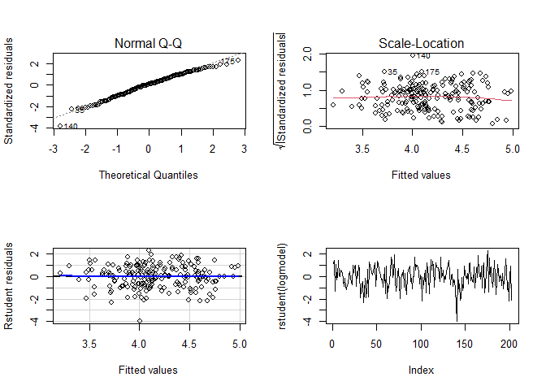
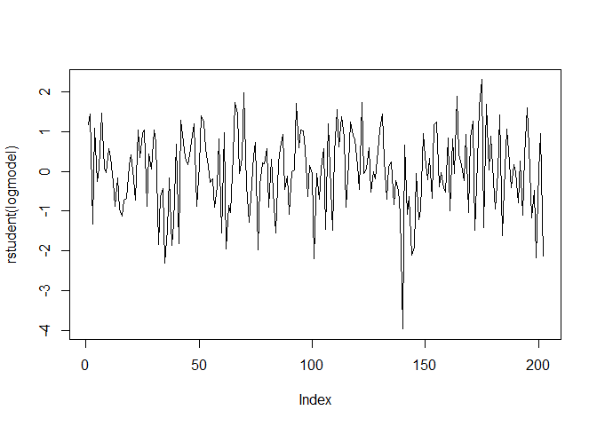

Ferretin Linear Regression with log-transformed data
================

***Multiple Linear Regression for Ferretin with log-transformed data.***

- **Model Selection, using stepwise method with AIC criterion.**

**Linear Regression using the log-transformed data in order to address
the assumptions’s issues and potentially improve the model’s
performance**

**Repeat the analysis using the logarithm transformed data for variables
Ferr, SSF and X.Bfat.**

``` r
mydata<-D
model0<-lm(log(Ferr)~.-SSF-X.Bfat+log(SSF)+log(X.Bfat),data=mydata)
summary(model0)
```

    ## 
    ## Call:
    ## lm(formula = log(Ferr) ~ . - SSF - X.Bfat + log(SSF) + log(X.Bfat), 
    ##     data = mydata)
    ## 
    ## Residuals:
    ##      Min       1Q   Median       3Q      Max 
    ## -1.87703 -0.35140  0.01061  0.37081  1.09605 
    ## 
    ## Coefficients:
    ##               Estimate Std. Error t value Pr(>|t|)    
    ## (Intercept)  12.460103   6.142908   2.028  0.04399 *  
    ## Sexmale       0.967157   0.217468   4.447 1.51e-05 ***
    ## SportField    0.402259   0.216372   1.859  0.06464 .  
    ## SportGym      0.039307   0.398132   0.099  0.92146    
    ## SportNetball  0.337654   0.173650   1.944  0.05339 .  
    ## SportRow      0.287357   0.147949   1.942  0.05366 .  
    ## SportSwim     0.332142   0.176781   1.879  0.06187 .  
    ## SportT400m   -0.073176   0.196578  -0.372  0.71014    
    ## SportTennis   0.648446   0.216098   3.001  0.00307 ** 
    ## SportTSprnt   0.377407   0.236996   1.592  0.11303    
    ## SportWPolo    0.463157   0.187046   2.476  0.01420 *  
    ## RCC          -0.341148   0.244379  -1.396  0.16443    
    ## WCC          -0.005732   0.023461  -0.244  0.80725    
    ## Hc           -0.022047   0.043408  -0.508  0.61214    
    ## Hg            0.108747   0.099108   1.097  0.27399    
    ## BMI          -0.122425   0.135452  -0.904  0.36729    
    ## LBM          -0.016132   0.033692  -0.479  0.63265    
    ## Ht           -0.045676   0.033314  -1.371  0.17205    
    ## Wt            0.054332   0.053621   1.013  0.31229    
    ## log(SSF)     -0.233760   0.485852  -0.481  0.63100    
    ## log(X.Bfat)   0.377914   0.577993   0.654  0.51405    
    ## ---
    ## Signif. codes:  0 '***' 0.001 '**' 0.01 '*' 0.05 '.' 0.1 ' ' 1
    ## 
    ## Residual standard error: 0.5253 on 181 degrees of freedom
    ## Multiple R-squared:  0.3524, Adjusted R-squared:  0.2808 
    ## F-statistic: 4.924 on 20 and 181 DF,  p-value: 1.551e-09

``` r
logmodel<-step(model0, direction='both')
```

    ## Start:  AIC=-240.26
    ## log(Ferr) ~ (Sex + Sport + RCC + WCC + Hc + Hg + BMI + SSF + 
    ##     X.Bfat + LBM + Ht + Wt) - SSF - X.Bfat + log(SSF) + log(X.Bfat)
    ## 
    ##               Df Sum of Sq    RSS     AIC
    ## - WCC          1    0.0165 49.963 -242.19
    ## - LBM          1    0.0633 50.010 -242.00
    ## - log(SSF)     1    0.0639 50.011 -242.00
    ## - Hc           1    0.0712 50.018 -241.97
    ## - log(X.Bfat)  1    0.1180 50.065 -241.78
    ## - BMI          1    0.2254 50.172 -241.35
    ## - Wt           1    0.2833 50.230 -241.11
    ## - Hg           1    0.3322 50.279 -240.92
    ## <none>                     49.947 -240.26
    ## - Ht           1    0.5187 50.465 -240.17
    ## - RCC          1    0.5378 50.484 -240.09
    ## - Sport        9    5.9966 55.943 -235.35
    ## - Sex          1    5.4580 55.405 -221.31
    ## 
    ## Step:  AIC=-242.19
    ## log(Ferr) ~ Sex + Sport + RCC + Hc + Hg + BMI + LBM + Ht + Wt + 
    ##     log(SSF) + log(X.Bfat)
    ## 
    ##               Df Sum of Sq    RSS     AIC
    ## - log(SSF)     1    0.0613 50.025 -243.94
    ## - LBM          1    0.0634 50.027 -243.93
    ## - Hc           1    0.0788 50.042 -243.87
    ## - log(X.Bfat)  1    0.1139 50.077 -243.73
    ## - BMI          1    0.2289 50.192 -243.27
    ## - Wt           1    0.2868 50.250 -243.03
    ## - Hg           1    0.3322 50.295 -242.85
    ## <none>                     49.963 -242.19
    ## - Ht           1    0.5231 50.486 -242.09
    ## - RCC          1    0.5310 50.494 -242.06
    ## + WCC          1    0.0165 49.947 -240.26
    ## - Sport        9    6.0001 55.963 -237.28
    ## - Sex          1    5.4521 55.415 -223.27
    ## 
    ## Step:  AIC=-243.94
    ## log(Ferr) ~ Sex + Sport + RCC + Hc + Hg + BMI + LBM + Ht + Wt + 
    ##     log(X.Bfat)
    ## 
    ##               Df Sum of Sq    RSS     AIC
    ## - LBM          1    0.0404 50.065 -245.78
    ## - log(X.Bfat)  1    0.0529 50.077 -245.73
    ## - Hc           1    0.0599 50.084 -245.70
    ## - BMI          1    0.2717 50.296 -244.85
    ## - Wt           1    0.2749 50.299 -244.84
    ## - Hg           1    0.3101 50.335 -244.69
    ## <none>                     50.025 -243.94
    ## - Ht           1    0.5772 50.602 -243.62
    ## - RCC          1    0.5910 50.616 -243.57
    ## + log(SSF)     1    0.0613 49.963 -242.19
    ## + WCC          1    0.0139 50.011 -242.00
    ## - Sport        9    5.9546 55.979 -239.22
    ## - Sex          1    5.5003 55.525 -224.87
    ## 
    ## Step:  AIC=-245.78
    ## log(Ferr) ~ Sex + Sport + RCC + Hc + Hg + BMI + Ht + Wt + log(X.Bfat)
    ## 
    ##               Df Sum of Sq    RSS     AIC
    ## - Hc           1    0.0741 50.139 -247.48
    ## - BMI          1    0.2407 50.306 -246.81
    ## - Wt           1    0.2799 50.345 -246.65
    ## - Hg           1    0.3265 50.391 -246.47
    ## <none>                     50.065 -245.78
    ## - Ht           1    0.5393 50.604 -245.62
    ## - RCC          1    0.5831 50.648 -245.44
    ## - log(X.Bfat)  1    0.6596 50.725 -245.13
    ## + LBM          1    0.0404 50.025 -243.94
    ## + log(SSF)     1    0.0383 50.027 -243.93
    ## + WCC          1    0.0145 50.050 -243.84
    ## - Sport        9    6.0618 56.127 -240.69
    ## - Sex          1    5.7656 55.831 -225.76
    ## 
    ## Step:  AIC=-247.48
    ## log(Ferr) ~ Sex + Sport + RCC + Hg + BMI + Ht + Wt + log(X.Bfat)
    ## 
    ##               Df Sum of Sq    RSS     AIC
    ## - BMI          1    0.2446 50.384 -248.50
    ## - Hg           1    0.2793 50.418 -248.36
    ## - Wt           1    0.2844 50.424 -248.34
    ## <none>                     50.139 -247.48
    ## - Ht           1    0.5517 50.691 -247.27
    ## - log(X.Bfat)  1    0.6688 50.808 -246.80
    ## + Hc           1    0.0741 50.065 -245.78
    ## + LBM          1    0.0547 50.084 -245.70
    ## + WCC          1    0.0223 50.117 -245.57
    ## + log(SSF)     1    0.0204 50.119 -245.56
    ## - RCC          1    1.2764 51.415 -244.40
    ## - Sport        9    6.2322 56.371 -241.81
    ## - Sex          1    5.9385 56.078 -226.87
    ## 
    ## Step:  AIC=-248.5
    ## log(Ferr) ~ Sex + Sport + RCC + Hg + Ht + Wt + log(X.Bfat)
    ## 
    ##               Df Sum of Sq    RSS     AIC
    ## - Wt           1    0.0672 50.451 -250.23
    ## - Hg           1    0.2179 50.602 -249.63
    ## <none>                     50.384 -248.50
    ## - log(X.Bfat)  1    0.5193 50.903 -248.43
    ## + BMI          1    0.2446 50.139 -247.48
    ## + Hc           1    0.0781 50.306 -246.81
    ## + log(SSF)     1    0.0543 50.329 -246.72
    ## - Ht           1    0.9600 51.344 -246.69
    ## + WCC          1    0.0254 50.358 -246.60
    ## + LBM          1    0.0169 50.367 -246.56
    ## - RCC          1    1.1621 51.546 -245.89
    ## - Sport        9    6.1070 56.491 -243.39
    ## - Sex          1    5.7303 56.114 -228.74
    ## 
    ## Step:  AIC=-250.23
    ## log(Ferr) ~ Sex + Sport + RCC + Hg + Ht + log(X.Bfat)
    ## 
    ##               Df Sum of Sq    RSS     AIC
    ## - Hg           1    0.2938 50.745 -251.06
    ## <none>                     50.451 -250.23
    ## + Hc           1    0.0791 50.372 -248.54
    ## + Wt           1    0.0672 50.384 -248.50
    ## + LBM          1    0.0479 50.403 -248.42
    ## + WCC          1    0.0282 50.423 -248.34
    ## + BMI          1    0.0274 50.424 -248.34
    ## + log(SSF)     1    0.0261 50.425 -248.33
    ## - log(X.Bfat)  1    1.1195 51.570 -247.79
    ## - Ht           1    1.2218 51.673 -247.40
    ## - RCC          1    1.3734 51.824 -246.80
    ## - Sport        9    6.7079 57.159 -243.01
    ## - Sex          1    8.7345 59.185 -219.97
    ## 
    ## Step:  AIC=-251.05
    ## log(Ferr) ~ Sex + Sport + RCC + Ht + log(X.Bfat)
    ## 
    ##               Df Sum of Sq    RSS     AIC
    ## <none>                     50.745 -251.06
    ## + Hg           1    0.2938 50.451 -250.23
    ## + Wt           1    0.1432 50.602 -249.63
    ## + LBM          1    0.1128 50.632 -249.50
    ## + BMI          1    0.0881 50.657 -249.41
    ## + Hc           1    0.0316 50.713 -249.18
    ## + log(SSF)     1    0.0183 50.726 -249.13
    ## + WCC          1    0.0135 50.731 -249.11
    ## - log(X.Bfat)  1    1.2262 51.971 -248.23
    ## - RCC          1    1.3496 52.094 -247.75
    ## - Ht           1    1.3559 52.101 -247.73
    ## - Sport        9    6.5111 57.256 -244.67
    ## - Sex          1   10.8808 61.626 -213.81

``` r
summary(logmodel)
```

    ## 
    ## Call:
    ## lm(formula = log(Ferr) ~ Sex + Sport + RCC + Ht + log(X.Bfat), 
    ##     data = mydata)
    ## 
    ## Residuals:
    ##      Min       1Q   Median       3Q      Max 
    ## -1.92600 -0.34117  0.03745  0.36443  1.15796 
    ## 
    ## Coefficients:
    ##               Estimate Std. Error t value Pr(>|t|)    
    ## (Intercept)   6.331106   1.300547   4.868 2.38e-06 ***
    ## Sexmale       1.049522   0.165302   6.349 1.58e-09 ***
    ## SportField    0.460053   0.178406   2.579  0.01068 *  
    ## SportGym      0.255112   0.347304   0.735  0.46353    
    ## SportNetball  0.295517   0.164155   1.800  0.07343 .  
    ## SportRow      0.314939   0.140590   2.240  0.02625 *  
    ## SportSwim     0.338880   0.167209   2.027  0.04411 *  
    ## SportT400m   -0.037264   0.181802  -0.205  0.83782    
    ## SportTennis   0.650249   0.211728   3.071  0.00245 ** 
    ## SportTSprnt   0.412000   0.215050   1.916  0.05690 .  
    ## SportWPolo    0.449563   0.178431   2.520  0.01258 *  
    ## RCC          -0.276502   0.123657  -2.236  0.02652 *  
    ## Ht           -0.014100   0.006291  -2.241  0.02618 *  
    ## log(X.Bfat)   0.347215   0.162902   2.131  0.03435 *  
    ## ---
    ## Signif. codes:  0 '***' 0.001 '**' 0.01 '*' 0.05 '.' 0.1 ' ' 1
    ## 
    ## Residual standard error: 0.5195 on 188 degrees of freedom
    ## Multiple R-squared:  0.342,  Adjusted R-squared:  0.2965 
    ## F-statistic: 7.518 on 13 and 188 DF,  p-value: 7.453e-12

So the fitted model is as follows:

**Log(Ferr) = 6.33 +1.05Sex + 0.46SportField + 0.25SportGym +
0.29SportNetball + 0.31SportRow + 0.34SportSwim - 0.04SportT400m +
0.65SportTennis + 0.41SportTSprnt +0.44SportWPolo -0.28RCC
-0.01Ht+0.35log(X,Bfat) + ε** ε ~ N(0, 0.52²)

- **Checking model assumptions**

1.  Normality of errors  
2.  Homoscedasticity of errors (Constant Variance)  
3.  Independence of errors  
4.  Linearity

- Plots

``` r
par(mfrow=c(2,2))
plot( logmodel, 2 )
plot( logmodel, 3 )
residualPlot(logmodel, type='rstudent')
plot(rstudent(logmodel), type='l')
```

<!-- -->

- Tests

1.  Linearity

``` r
residualPlots(logmodel, plot=F)
```

    ##             Test stat Pr(>|Test stat|)
    ## RCC           -0.4204           0.6747
    ## Ht             0.4971           0.6197
    ## log(X.Bfat)    0.3329           0.7396
    ## Tukey test     0.1803           0.8569

> So we do not reject the null hypothesis that the quadratic term is
> equal to zero.

2.  Constant Variance

``` r
ncvTest(logmodel)
```

    ## Non-constant Variance Score Test 
    ## Variance formula: ~ fitted.values 
    ## Chisquare = 0.01980703, Df = 1, p = 0.88808

> So we do not reject the null hypothesis for constant variance.

3.  Normality

``` r
shapiro.test(rstudent(logmodel))
```

    ## 
    ##  Shapiro-Wilk normality test
    ## 
    ## data:  rstudent(logmodel)
    ## W = 0.98461, p-value = 0.02657

> So we reject the null hypothesis for normality.

4.Independence of errors

``` r
library(randtests)
plot(rstudent(logmodel), type='l')
```

<!-- -->

``` r
runs.test(logmodel$res)
```

    ## 
    ##  Runs Test
    ## 
    ## data:  logmodel$res
    ## statistic = -1.1286, runs = 94, n1 = 101, n2 = 101, n = 202, p-value =
    ## 0.2591
    ## alternative hypothesis: nonrandomness

> So we do not reject the null hypothesis of randomness(p-value =
> 0.2591).

- ***According to the above analysis of the diagnostics, the log model
  it is much better although the normality assumption still is not
  fixed.***

> ***So the model we prefer is the log model.***

- **Prediction of Ferritins for a female that goes to the Gym**

> Based on the logistic regression model, Ferritins is approximately
> 21.63

> The 95% confidence interval that future observations will fall within
> the range of approximately 5.96 to 78.49.

``` r
xnew <-data.frame(Sex=c('female'),Sport=c('Gym'),RCC=c(mean(D$RCC)),Ht=c(mean(D$Ht)),X.Bfat=c(log(mean(D$X.Bfat))))
predict(logmodel,newdata=xnew,interval="prediction")
```

    ##        fit      lwr      upr
    ## 1 3.074283 1.785497 4.363068

``` r
exp(3.074283)
```

    ## [1] 21.63436

``` r
exp(1.785497)
```

    ## [1] 5.962543

``` r
exp(4.363068)
```

    ## [1] 78.4976
